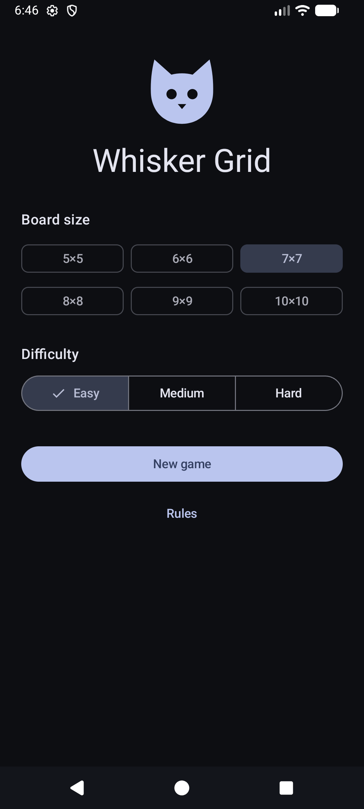
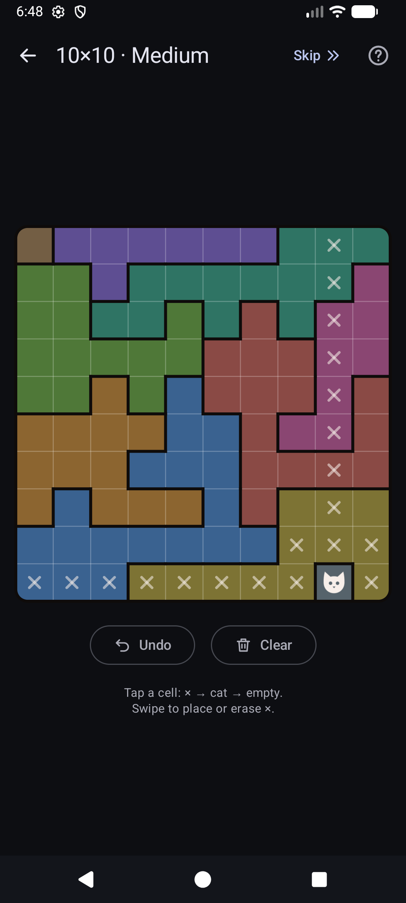
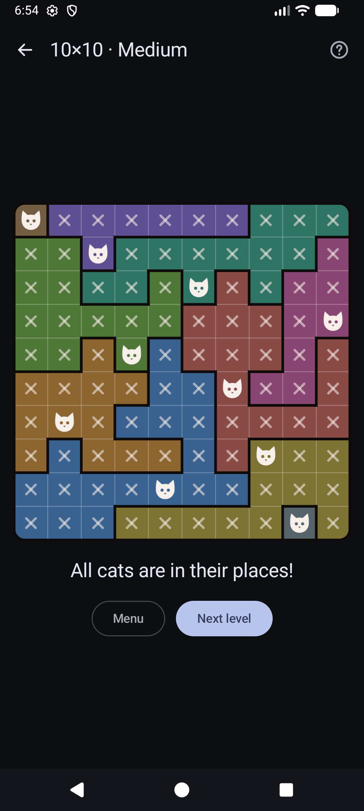
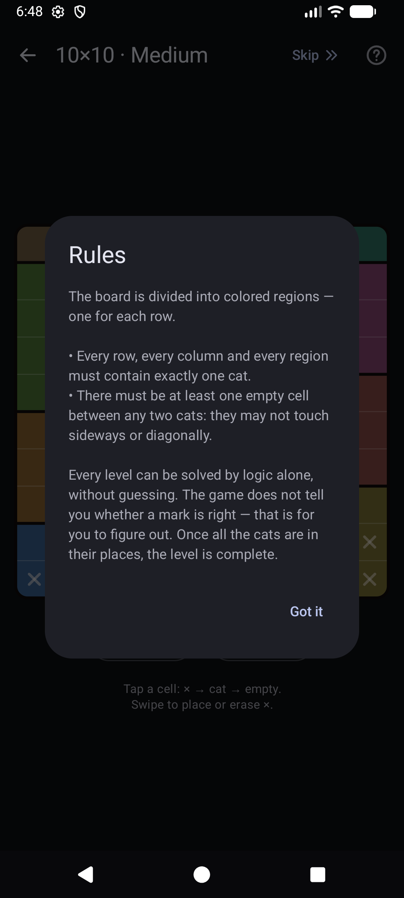

# Whisker Grid

An offline logic puzzle for Android: place one cat in every row, every column and every
colored region so that no two cats touch, not even diagonally. Every level is generated on
the device and can be solved by logic alone, without guessing.

<p>
  
  
  
  
</p>

## Features

- Board sizes from 5×5 to 10×10, three difficulty levels (Hard needs at least 6×6)
- Levels are generated on the device and checked by a logic solver, so each one has a
  single solution that can be reached without guessing
- Tap a cell to cycle × → cat → empty; swipe to place or erase × marks
- Undo, Clear, and Skip to set a board aside and come back to it later
- Progress is saved automatically; unfinished boards are listed under "Skipped boards"
- Interface languages: Українська, English, Deutsch, Français, Italiano, Español
- Free, no ads, no internet permission, nothing is sent anywhere

## Rules

The board is divided into colored regions, one for each row.

- Every row, every column and every region must contain exactly one cat.
- Cats may not touch each other sideways or diagonally.

The game does not say whether a mark is right. The level is complete once all the cats
are in their places.

## Building

Requirements: Android SDK with platform 37. The Gradle daemon runs on JDK 25
([gradle-daemon-jvm.properties](gradle/gradle-daemon-jvm.properties)); if it is not installed,
Gradle downloads it automatically.

```sh
./gradlew test               # unit tests
./gradlew :app:installDebug  # build and install on a connected device or emulator
./gradlew :app:assembleRelease
```

The release build is signed with the key from `app/keystore.properties` if that file
exists, otherwise with the debug key.

### Releases

[GitHub Actions](.github/workflows) runs tests, lint and a debug build on every push and pull
request to `main`. Pushing a `vX.Y.Z` tag builds a signed release APK and attaches it to a
GitHub release. It needs these repository secrets:

| Secret | Value |
|---|---|
| `ANDROID_KEYSTORE_BASE64` | release keystore, base64-encoded |
| `ANDROID_KEYSTORE_PASSWORD` | keystore password |
| `ANDROID_KEY_ALIAS` | key alias |
| `ANDROID_KEY_PASSWORD` | key password |

## Project structure

- `game/` — puzzle model, level generator and logic solver
- `data/` — saved games and history
- `ui/` — Compose screens, board and ViewModel

## License

[GNU GPL v3](LICENSE)
